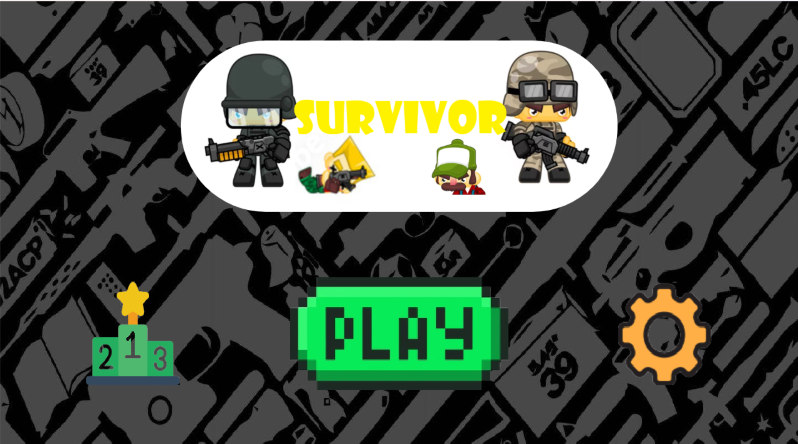
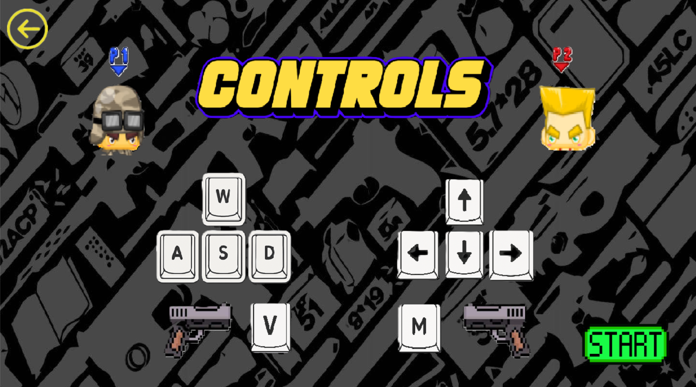
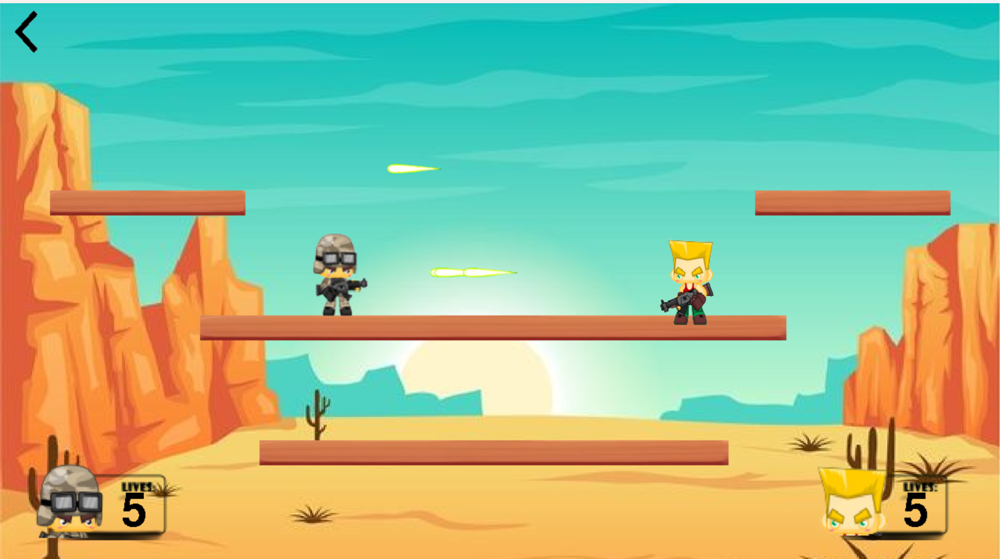
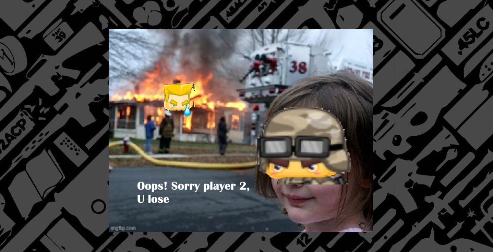

# 🎮 Survivor – 2-Player Shooting Game Built with Pygame (Python)

**Survivor** is a fast-paced, local multiplayer shooting game inspired by the classic **Gun Mayhem**. Designed for two players sharing a single keyboard, the game challenges you to outshoot and outmaneuver your opponent in a series of chaotic battles.

🎯 **Objective:** Knock out your opponent **5 times** before they do the same to you. The first player to reach 5 KOs wins the match!

